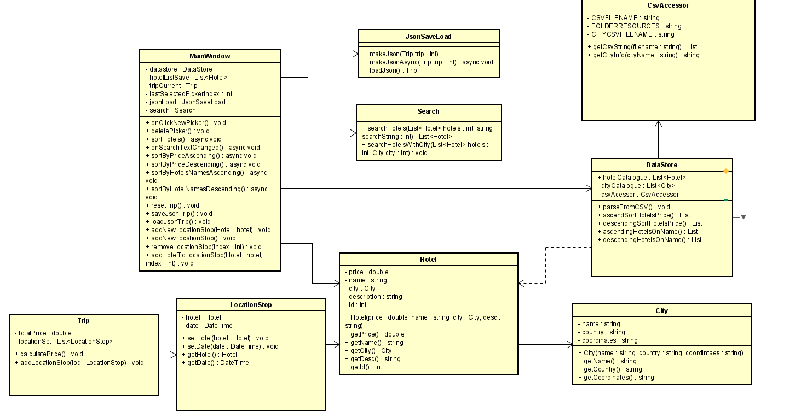

# C# Threading - Trip Buddy
Project completed by 3rd Year NHL Stenden Students  
- Dimitri Vastenhout
- Teodor Folea
- Mathew Shardin
- Corvin Wittmaack

## Introduction
The team is set out to develop a travel itinerary planning application. The application can be used to select accomodation in different cities (travel stops). Based on the selction the application can generate a travel itinerary and write it into a file.

## Application Description
Using the application users can:
- Select a number of cities (locatons) one would like to travel to
- View hotels avaliable in the locations chosen along with their prices
- Calculate final price of the trip
- Save a final selection in a file
- Interact with an app using a UI MAUI interface

The application will be able to:
- Contain a DB with hotel information
- Parse a CSV file with hotel information into an internal DB (MSSQL)
- Sort hotels based on user preference
- Display graphs that outline hotel prices per city

## Input & Output

## Class Diagram

## MoSCoW Analysis
| Priority    | Task                                        |
| ----------- | ------------------------------------------- |
| Must have   | GUI   Displaying number of hotels   Based on the selection of  the location threading will be used to write in a JSON file   Import trip into program from a file, using a locking method to make sure they dont write to it at the same time   	    |
| Should have | Distance between hotels using Google API    |
| Could have  | Time between hotels using Google API   Getting coordinates of a city   CSV entries entered with asynchronous IO   Search for the name of a hotel using async         |
| Won't have  | Booking hotels inside the app               |

### Input

| Case       | Type     | Conditions   |
| ---------- | -------- | ------------ |
| Hotel      | `String` | not empty    |
| Location   | `String` | not empty    |
| CSV Import | `CSV`    | valid format |
| JSON file  | `JSON`   | valid format |

### Output

| Case         | Type           |
| ------------ | -------------- |
| LocationStop | `LocationStop` |
| Trip         | `Trip`         |

### Calculations

| Case                    | Calculation   |
| ----------------------- | ------------- |
| CalculateTotalTripPrice | `Price*Price` |
| SplittingCsv            | `Division`    |
| SortingHotels           | `Comparison`  |

### Remarks

- Input will be validated
- Players with the same username cannot connect
- Lobby can be created only once with the same code
